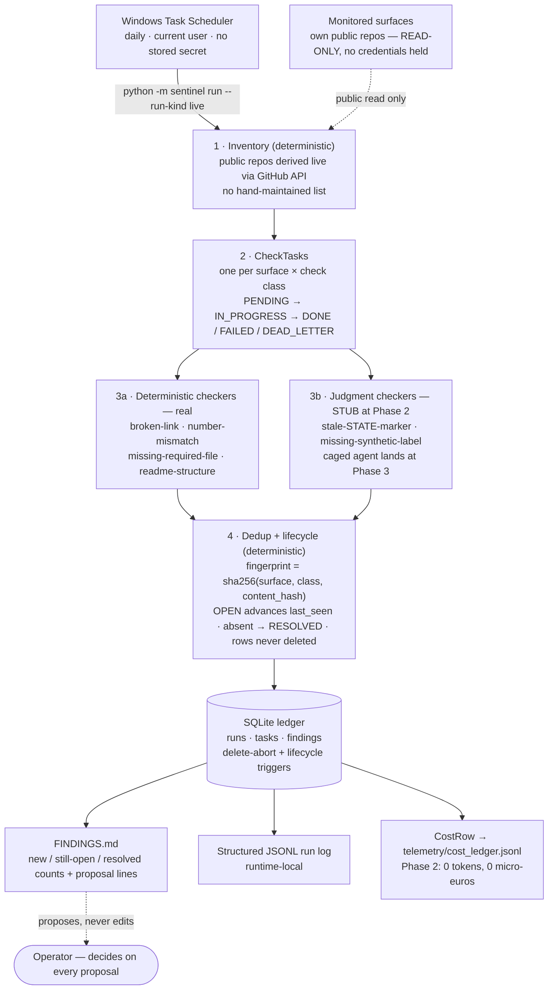

# ai-portfolio-sentinel

> **LEARNING LANE (EXPERIMENT).** This is a personal learning project, not a
> product or a client-facing service. The eval gate runs on labeled
> **synthetic** fixtures; live scheduled runs monitor only Kristian's own
> public repositories. No production, uptime, autonomy, or third-party
> monitoring claim is made anywhere in this repo.
> **Status: in development toward production-ready.** No production
> claim is made at the present development stage. A bounded
> production-ready claim may be made only after every
> production-readiness program gate passes (BLUEPRINT §11).

## Problem

Every engine in this portfolio so far has been demonstrated in a single,
human-initiated run. No artifact yet demonstrates the harder operational
class companies hire "agent reliability" people for: a system that runs
**unattended, on a schedule, for weeks**, where failures show up as
accumulation — duplicate findings, drifting state, silent crashes that
look like quiet success — rather than one wrong answer.

## Solution

A scheduled monitor over Kristian's own public portfolio repos. Each run
derives the repo inventory live from GitHub (no hand-maintained list to go
stale), runs deterministic checks (link liveness, README↔EVAL_RESULTS
number consistency, required-file presence, README structure), deduplicates
findings against a persistent ledger, and appends proposals to
`FINDINGS.md`. Two judgment classes — stale state markers and missing
synthetic labels — are stubbed at Phase 2 and land with a caged checker
agent at Phase 3. It never writes to any repo it monitors — it holds no
credentials for them.

## System

One scheduled pass, end to end. Deterministic control plane, zero LLM
calls at this phase.

**Runtime surface (decided at Phase 2, BLUEPRINT §11(a)).** Core
pipeline: Python 3.12 with pinned dependencies. Tested platform:
`ubuntu-latest` + Python 3.12 — the single declared CI leg, run on
every push. Scheduling host: the operator's current Windows
environment via Task Scheduler; the PowerShell scheduling tooling is
Windows-only and is not covered by the CI leg. No other platform is
claimed or tested.

Data shapes, ledger schema, hashing and lifecycle rules:
[DATA_CONTRACT.md](DATA_CONTRACT.md). What is stored, for how long, and
what is never stored: [DATA_RETENTION_POLICY.md](DATA_RETENTION_POLICY.md).
Full design, phase gates, and eval thresholds: [BLUEPRINT.md](BLUEPRINT.md).

## Outcome

Phase 0 (scaffold) in progress. No runs, no eval results, and no outcome
to report yet — this section updates only when a phase gate closes with
evidence (BLUEPRINT.md §6).

## Version Log

| version | date | change |
|---|---|---|
| v0.1 | 2026-07-13 | Tier 0 scaffold: BLUEPRINT.md, CLAUDE.md, decisions/0001, STATE.md committed. Phase 0 in progress. |
| v0.2 | 2026-08-03 | Phase 0 closed: SPEC.md, claims-ladder amendments, program ADR, cost telemetry (CostRow + JSONL ledger + dry run + 36 tests), CI on push, publish-gate canary. Production-readiness program opened (owner ruling 2026-08-03). |
