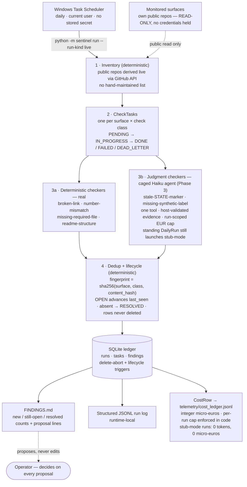

# ai-portfolio-sentinel

> **LEARNING LANE (EXPERIMENT).** This is a personal learning project, not a
> product or a client-facing service. The eval gate runs on labeled
> **synthetic** fixtures; live scheduled runs monitor only Kristian's own
> public repositories. No production, uptime, autonomy, or third-party
> monitoring claim is made anywhere in this repo.
> **Status: in development toward production-ready.** No production
> claim is made at the present development stage. A bounded
> production-ready claim may be made only after every
> production-readiness program gate passes (BLUEPRINT §11).

## Problem

Every engine in this portfolio so far has been demonstrated in a single,
human-initiated run. No artifact yet demonstrates the harder operational
class companies hire "agent reliability" people for: a system that runs
**unattended, on a schedule, for weeks**, where failures show up as
accumulation — duplicate findings, drifting state, silent crashes that
look like quiet success — rather than one wrong answer.

## Solution

A scheduled monitor over Kristian's own public portfolio repos. Each run
derives the repo inventory live from GitHub (no hand-maintained list to go
stale), runs deterministic checks (link liveness, README↔EVAL_RESULTS
number consistency, required-file presence, README structure), deduplicates
findings against a persistent ledger, and appends proposals to
`FINDINGS.md`. Two judgment classes — stale state markers and missing
synthetic labels — need judgment rather than pattern matching, so they
are handled by a caged checker agent: one narrowly-scoped Haiku call per
task, exactly one tool, no credentials, and every cited piece of
evidence re-validated by the host against the source document. It never
writes to any repo it monitors — it holds no credentials for them.

Two facts that are easy to blur, kept apart here:

- **Repository capability.** The Phase-3 caged judgment checker is
  implemented and has passed its Haiku validation on the frozen
  synthetic fixture bed (2026-08-22).
- **Standing scheduled operation.** The standing `SentinelDailyRun`
  task still launches in **stub mode**, so the daily schedule makes
  **no** model calls. Running the schedule in agent mode is a separate,
  later decision that has not been taken.

## System

One scheduled pass, end to end. The control plane is deterministic
throughout; the only model calls anywhere in the system are the two
judgment check classes — and the standing schedule still runs those in
stub mode.

**Runtime surface (decided at Phase 2, BLUEPRINT §11(a)).** Core
pipeline: Python 3.12 with pinned dependencies. Tested platform:
`ubuntu-latest` + Python 3.12 — the single declared CI leg, run on
every push. Scheduling host: the operator's current Windows
environment via Task Scheduler; the PowerShell scheduling tooling is
Windows-only and is not covered by the CI leg. No other platform is
claimed or tested.

Data shapes, ledger schema, hashing and lifecycle rules:
[DATA_CONTRACT.md](DATA_CONTRACT.md). What is stored, for how long, and
what is never stored: [DATA_RETENTION_POLICY.md](DATA_RETENTION_POLICY.md).
Full design, phase gates, and eval thresholds: [BLUEPRINT.md](BLUEPRINT.md).

## Outcome

Phase 3 closed 2026-08-22. The caged judgment checker is implemented and
passed its designated validation on the frozen **synthetic** fixture bed,
independently verified before being recorded.

- **Validation result (SYNTHETIC fixtures, REAL Haiku calls).** 60
  emitted findings, 60 true positives, 0 false positives, 0 misses
  against the 60 frozen injected positives; pooled precision and recall
  both 1.0000; all six check classes at 10/10 per-class recall; 0/166
  clean distractor surfaces falsely flagged. Every frozen invariant and
  every execution-validity predicate PASS across both designated runs.
  Two earlier attempts failed honestly, and both are still recorded in
  full — nothing was relabeled or softened to reach this result.
- **One real failure, recovered inside its bounds.** One model call hit
  the SDK per-call budget ceiling and failed. A single bounded
  re-execution completed the same logical task, and the validation
  protocol counts that as valid only because the failure's mechanized
  class was reconstructed from durable ledger rows — never from the SDK
  error subtype alone, and never from exception prose. One observed
  recovery is not a guarantee that every future budget-ceiling event
  recovers.
- **Cost.** Accounted consumption 645,883 + 575,877 = 1,221,760
  micro-EUR across the two runs, inside the declared 750,000 per-run and
  1,500,000 two-run ceilings. These are accounted-consumption acceptance
  ceilings, not guaranteed provider-spend maxima.
- **Tests and coverage.** 741 tests passing, 3 skipped (Phase-4 stubs
  only), 91.1% coverage
  (`python -m coverage run -m pytest && python -m coverage report -m`).
- **Scheduled runs (LIVE — real data).** The Phase-2 scheduler evidence
  stands unchanged: two consecutive runs triggered by Windows Task
  Scheduler with no manual invocation between them
  (`r-91ec8071505a4ba7905fe6f9ef4c53f4`,
  `r-5ac95d4bc6fd4c55a7f739547090098f`), both COMPLETED, 190/190 tasks
  terminal on each, and exact dedup behaviour on the second run.
  `SentinelDailyRun` remains stub-mode, so the standing daily schedule
  still makes no model calls.

The eval gate runs on **synthetic** fixtures with a frozen answer key
(unchanged since `4d46c1d4fc3c4f485a83f44fa54afa6b04b1f541`); scheduled
runs are **live** — real data against the operator's own public
repositories. The two are labeled everywhere and neither borrows the
other's credibility. Status: in development toward production-ready. No
production claim is made — the production-readiness program is still
open. **Phase 4 is permitted and is next; it has not started, and the
lane's governing work item remains open.**

## Version Log

| version | date | change |
|---|---|---|
| v0.1 | 2026-07-13 | Tier 0 scaffold: BLUEPRINT.md, CLAUDE.md, decisions/0001, STATE.md committed. Phase 0 in progress. |
| v0.2 | 2026-08-03 | Phase 0 closed: SPEC.md, claims-ladder amendments, program ADR, cost telemetry (CostRow + JSONL ledger + dry run + 36 tests), CI on push, publish-gate canary. Production-readiness program opened (owner ruling 2026-08-03). |
| v0.3 | 2026-08-05 | Phase 2 closed: deterministic control plane end to end (4 real checkers + 2 Phase-3-stubbed judgment classes), SQLite ledger with fingerprint dedup and OPEN/RESOLVED finding lifecycle, FINDINGS.md writer, structured JSONL logging, zero-cost CostRow telemetry, Windows Task Scheduler tooling with a standing `SentinelDailyRun` task (daily, 07:15 local). 482 tests passing, exactly 4 skips (Phase 3/4 stubs only), 89.9% line coverage. Implementation commit `bfa56d680c6a0980cef8b9494b3a307defd4318e`; this Version Log entry's own closure commit's exact SHA and CI run are recorded in the kristian-os Q-77 annotation (`q77-p2-record-a`), not embedded here (a commit cannot truthfully cite its own hash). Scheduler gate: two consecutive Task-Scheduler-triggered live runs (`r-91ec8071505a4ba7905fe6f9ef4c53f4`, `r-5ac95d4bc6fd4c55a7f739547090098f`), 190/190 tasks terminal on each, `LastTaskResult=0` on each, zero-cost CostRows, zero manual invocation between fires. Q-77 remains open; Phase 3 (caged checker agent) is next. |
| v0.4 | 2026-08-05 | Phase 3 caged checker agent implemented (`agents/checker/`: cage, run-scoped EUR budget, host-side evidence validation, main-ledger audit) at commit `cf713649bc1aaf31f1494112921d7741493533b0`, CI green, 535 tests passing / 3 skips (Phase 4 only). Designated Haiku dev gate then ran and recorded an honest **FAIL**: pooled precision 0.8393 (< 0.90), pooled recall 0.7833 (< 0.85); per-class recall FAIL on `stale-STATE-marker` (2/10) and `missing-synthetic-label` (5/10), PASS on all four deterministic classes (10/10 each) and the clean-false-flag rate. No fixture, threshold, prompt, or model change was made after seeing this result. Full evidence: `EVAL_RESULTS.md`; narrative: `posts/2026-08-05-phase-3-gate.md`. **Phase 3 remains open; Q-77 remains open.** `SentinelDailyRun` unchanged, stub-mode. No production or capability claim is made for the judgment classes. |
| v0.5 | 2026-08-22 | Phase 3 closed. The one prospective validation cycle authorized by `adr/0009-post-adr0008-phase3-validation-protocol.md` executed at source commit `54f5ce3d0e066417104b47fecbc49d05b5303859` and was independently verified **PASS**: 60 emitted / 60 true positives / 0 false positives / 0 misses against the 60 frozen synthetic positives, pooled precision and recall 1.0000, all six classes 10/10, 0/166 clean false flags, every frozen invariant and every ADR-0009 execution-validity predicate PASS across runs `r-cce0280d1a824ca6a12ac8faf42a30e1` and `r-e68b8878b62b453eaf6cf5fe2544a6bb`. Exactly one bounded SDK-budget recovery was exercised and held (one FAILED invocation whose mechanized class reconstructed as `SDK_BUDGET_CEILING`, then one COMPLETED invocation for the same logical task; zero `BREAKER_REFUSED` outcomes persisted; zero invalid logical histories). Accounted consumption 645,883 + 575,877 = 1,221,760 micro-EUR, inside the declared 750,000 per-run and 1,500,000 two-run acceptance ceilings. 741 tests passing, 3 skips (Phase 4 only), 91.1% coverage. Raw evidence is retained externally and identified by SHA-256 in `EVAL_RESULTS.md`; `artifacts/phase3_dev_gate.json` is untouched and still carries the 2026-08-19 re-gate artifact. This entry's own closure commit SHA and CI run are recorded in the private operations OS annotation, not embedded here (a commit cannot truthfully cite its own hash). Phase 4 is permitted but NOT started; `SentinelDailyRun` unchanged, stub-mode; the lane's governing work item remains open. No production or production-ready claim is made — the production-readiness program remains open. |
